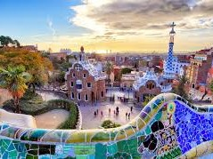

<h1 > <b>Welcome!</b></h1>

  

    

      <a href="images/mapspain (1).jpg">
        
        

          
El mapa de España / The map of Spain.

        

      </a>
    

  

  

    

      <a href="images/espanol (1).jpg">
        
        

          
 Estas listo para aprender? / Are you ready to learn? 

        

      </a>
    

  

  

    

      <a href="images/spain.jpg">
        
        

          
Esto es Parc Güell en Barcelona que Gaudí ha diseñado. / This is Parc Güell in Barcelona that Gaudí had designed.

        

      </a>
    

  

 
<h1> <b>Introduction</b> </h1> 
<h2> Why study a language with us?</h2>

 At <b> Speedy Spanish </b> we believe that in the face of globalisation and advanced technology, it is becoming more and more imperative to understand one or more languages. Not only does it increase job prospects but it also broadens your social horizons. The language learning process is full of surprises. One might not expect it but learning a language is not just about grammar rules and how good your pronounciation is. It is also about the country's history, the culture, the gastronomy and it's people. This website is aimed at beginners and intermediate Spanish language learners.  

 
<iframe width="713" height="401" src="https://www.youtube.com/embed/o_XVt5rdpFY" frameborder="0" allow="accelerometer; autoplay; clipboard-write; encrypted-media; gyroscope; picture-in-picture" allowfullscreen></iframe>

 
<h2> <b>About The Creator </b> </h2>

 <i> My name is Karol Visentin Lemes and I created this website with the aims of not only teaching you Spanish but to hopefully spark a love for language learning. As a language learner myself, I created this website to help but it most definitely isn't the be all and end all of Spanish. Language is learnt through experience so if there is one piece of advice I could give, it would be to take every opportunity you get to practise the language you're learning no matter how scary it may seem!
   
 Here are three facts about me:

   <ol>
    <li> I am multilingual. I speak Portuguese, Spanish and English. </li>
    <li> My favourite 'untranslatable' word is the German word <b>Schadenfreude</b> which means to receive enjoyment from other people's misery.  </li>
    <li> I'm learning Japanese to be able to watch anime without the subtitles and eventually go to Japan. </li>
 </ol> </i>
    
 
 A few of my favourite language learning websites are <a href="https://www.linguee.com/english-spanish" target="_blank">Linguee</a> and <a href="https://www.wordreference.com/es/translation.asp" target="_blank">WordReference</a>  

