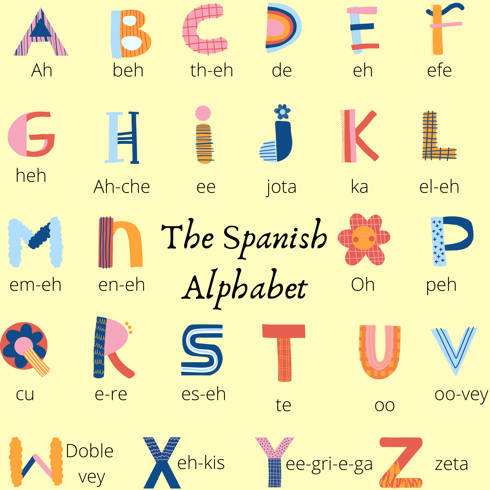
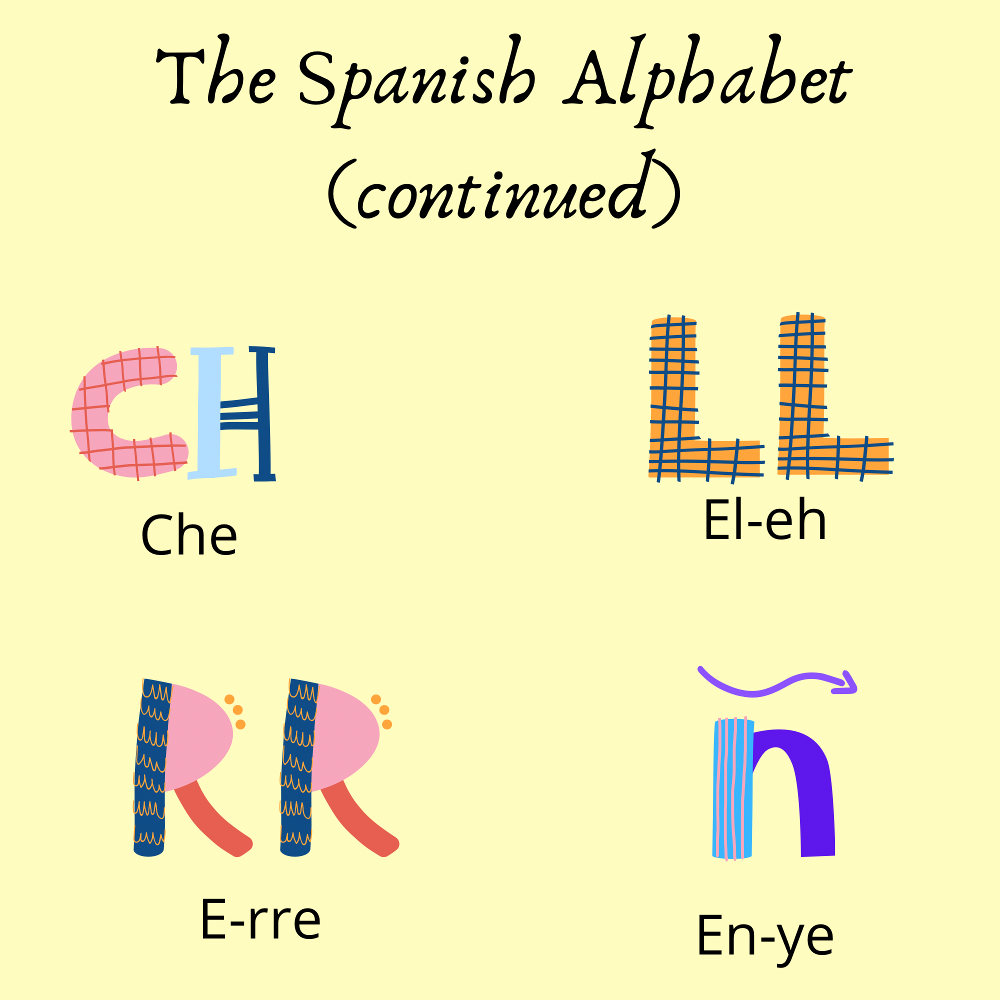

<h1> <b>Grammar</b></h1>

 Grammar is the whole system and structure of a language or of languages in general, usually taken as consisting of syntax and morphology (including inflections) and sometimes also phonology and semantics. This page is to help you familarise with the most common tenses as well as the spanish alphabet which has a few extra letters.
  
 

  <h3>Personal Pronouns</h3>
  
 To start you must know the personal pronouns in Spansih. There are 12 of them and they are generally the same with the exception of gender seperations and two additional pronoun <strong>'you singular' and 'you plural' (useted/ustedes)</strong> which does not exist in English. As a Romance language, Spanish orders mixed gendered groups as <strong> masculine</strong> and all female groups as <strong>feminine</strong> . See below the 12 personal pronouns and their translations;
  <ol>
    <li>Yo — I </li>
   <li>Él — He </li>
   <li>Ella — She </li>
   <li>Tú — You (singular, informal) </li>
   <li>Usted — You (singular, formal) </li>
   <li>Nosotros — We (all-male or mixed group) </li>
   <li>Nosotras — We (all female) </li>
   <li>Vosotros — You (plural, informal, all-male or mixed group) </li>
   <li>Vosotras — You (plural, informal, all female) </li>
   <li>Ellos — They (all-male or mixed group) </li>
   <li>Ellas — They (all female) </li>
   <li>Ustedes — You (plural, formal) </li>
</ol>

  <h3>How to Conjugate</h3>
  
 In the simplest of definitions, a conjugation is the modification of a verb so that it shows more information about an action. The information can include who does it, when and even sets a mood. Spanish conjugation sets a different ending for each personal pronoun and verb. This means that you don't need to use personal pronouns as it is already indicated via the conjugation unless you really want to emphasize who is doing the action. For more help, visit <a href="https://www.wordreference.com/conj/EsVerbs.aspx" target="_blank">WordReference Conjugation page</a>.

  
  
 All infinitives end in either -AR -IR or -ER. These endings are the ones to focus on because they'll be the part that changes in a conjugation. Drop these endings and add the appropriate endings. <small><i>For example: the infinitive ESCRIBIR. If I wanted to say "we writes essays" it would be "escribimos ensayos". The ending of -IR is replaced by -IMOS.</i> </small> The -ER and -IR ending changes are usually the same or similar. <i> <smal> For example: Escribir and Comer, in the we pronoun would change to escribimos and comimos.</i> </small> However, as with most rules, not just grammar, there are exceptions and irregular verbs.

  
  <h3> Conjugation Tables</h3>
  
The conjugation of AR verb "Amar" in the present, preterite and simple future tenses:
      
   

  <table class="table table-striped">
    <thead>
      <tr>
        <th>personal pronoun</th>
        <th>presente</th>
        <th>preterito</th>
        <th> futuro </th>
      </tr>
    </thead>
    <tbody>
      <tr>
        <td> yo</td>
        <td>Am<em>o</em></td>
        <td>Am<em>é</em></td>
        <td>Amar<em>é</em></td>
      </tr>
      <tr>
         <td>tu</td>
        <td>Am<em>as</em></td>
        <td>Am<em>aste</em></td>
        <td>Amar<em>ás</em></td>
      </tr>
      <tr>
         <td> el/ ella </td>
        <td>Ama</td>
        <td>Amó</td>
        <td>Amará</td>
      </tr>
       <tr>
          <td>nosotros</td>
        <td>Amamos</td>
        <td>Amamos</td>
        <td>Amaremos</td>
      </tr>
      <tr>
         <td>vosotros</td>
        <td>Amáis</td>
        <td>Amasteis</td>
        <td>Amaréis</td>
         </tr>
         <tr>
        <td>ellos/ellas/ustedes </td>
        <td>Aman</td>
        <td>Amaron</td>
        <td>Amarán</td>
         </tr>
      <tr>
         <td>vos</td>
        <td>Amás</td>
        <td>Amaste</td>
        <td>Amarás</td>
         </tr>
    </tbody>
  </table>
  

  
  
The conjugation of AR verb "Amar" in the preterite and conditional tenses:
            
  

  <table class="table table-striped">
    <thead>
      <tr>
         <th>personal pronoun</th>
        <th>Imperfecto</th>
        <th>Conditional</th>
      </tr>
    </thead>
    <tbody>
      <tr>
        <td> yo</td>
        <td>amaba</td>
        <td>amaría</td>
      </tr>
      <tr>
        <td>tu</td>
        <td>amabas</td>
        <td>amarías</td>
      </tr>
      <tr>
        <td>el/ ella</td>
        <td>amaba</td>
        <td>amaría</td>
      </tr>
       <tr>
        <td> nosotros </td>
        <td>amábamos</td>
        <td>amaríamos</td>
      </tr>
      <tr>
        <td>vosotros</td>
        <td>amabais</td>
        <td>amaríais</td>
         </tr>
         <tr>
        <td> ellos/ellas/ ustedes </td>
        <td>amaban</td>
        <td>amarían</td>
         </tr>
      <tr>
        <td>vos</td>
        <td>amabas</td>
        <td>amarías</td>
         </tr>
    </tbody>
  </table>
  

 
<iframe src="https://h5p.org/h5p/embed/1075488" width="1090" height="573" frameborder="0" allowfullscreen="allowfullscreen" allow="geolocation *; microphone *; camera *; midi *; encrypted-media *"></iframe>
