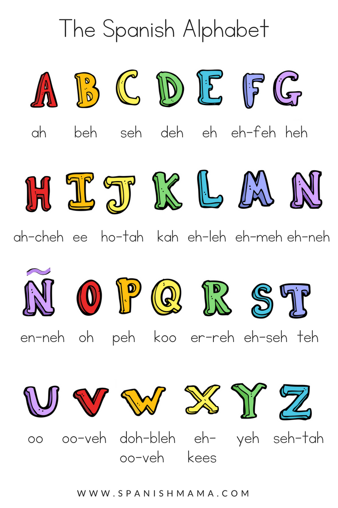

<h1> <b>Grammar</b></h1>

 Grammar is the whole system and structure of a language or of languages in general, usually taken as consisting of syntax and morphology (including inflections) and sometimes also phonology and semantics.
  
 

  <h3>Conjugation Tables</h3>
   
The conjugation of AR verb "Amar" in the present, preterite and simple future tenses:
      
   

  <table class="table table-striped">
    <thead>
      <tr>
        <th>presente</th>
        <th>preterito</th>
        <th> futuro </th>
      </tr>
    </thead>
    <tbody>
      <tr>
        <td>Amo</td>
        <td>Amé</td>
        <td>Amaré</td>
      </tr>
      <tr>
        <td>Amas</td>
        <td>Amaste</td>
        <td>Amarás</td>
      </tr>
      <tr>
        <td>Ama</td>
        <td>Amó</td>
        <td>Amará</td>
      </tr>
       <tr>
        <td>Amamos</td>
        <td>Amamos</td>
        <td>Amaremos</td>
      </tr>
      <tr>
        <td>Amáis</td>
        <td>Amasteis</td>
        <td>Amaréis</td>
         </tr>
         <tr>
        <td>Aman</td>
        <td>Amaron</td>
        <td>Amarán</td>
         </tr>
      <tr>
        <td>Amás</td>
        <td>Amaste</td>
        <td>Amarás</td>
         </tr>
    </tbody>
  </table>
  

  
  
The conjugation of AR verb "Amar" in the preterite and conditional tenses:
            
  

  <table class="table table-striped">
    <thead>
      <tr>
        <th>Imperfecto</th>
        <th>Conditional</th>
      </tr>
    </thead>
    <tbody>
      <tr>
        <td>amaba</td>
        <td>amaría</td>
      </tr>
      <tr>
        <td>amabas</td>
        <td>amarías</td>
      </tr>
      <tr>
        <td>amaba</td>
        <td>amaría</td>
      </tr>
       <tr>
        <td>amábamos</td>
        <td>amaríamos</td>
      </tr>
      <tr>
        <td>amabais</td>
        <td>amaríais</td>
         </tr>
         <tr>
        <td>amaban</td>
        <td>amarían</td>
         </tr>
      <tr>
        <td>amabas</td>
        <td>amarías</td>
         </tr>
    </tbody>
  </table>
  

 
<iframe src="https://h5p.org/h5p/embed/1075488" width="1090" height="573" frameborder="0" allowfullscreen="allowfullscreen" allow="geolocation *; microphone *; camera *; midi *; encrypted-media *"></iframe>
