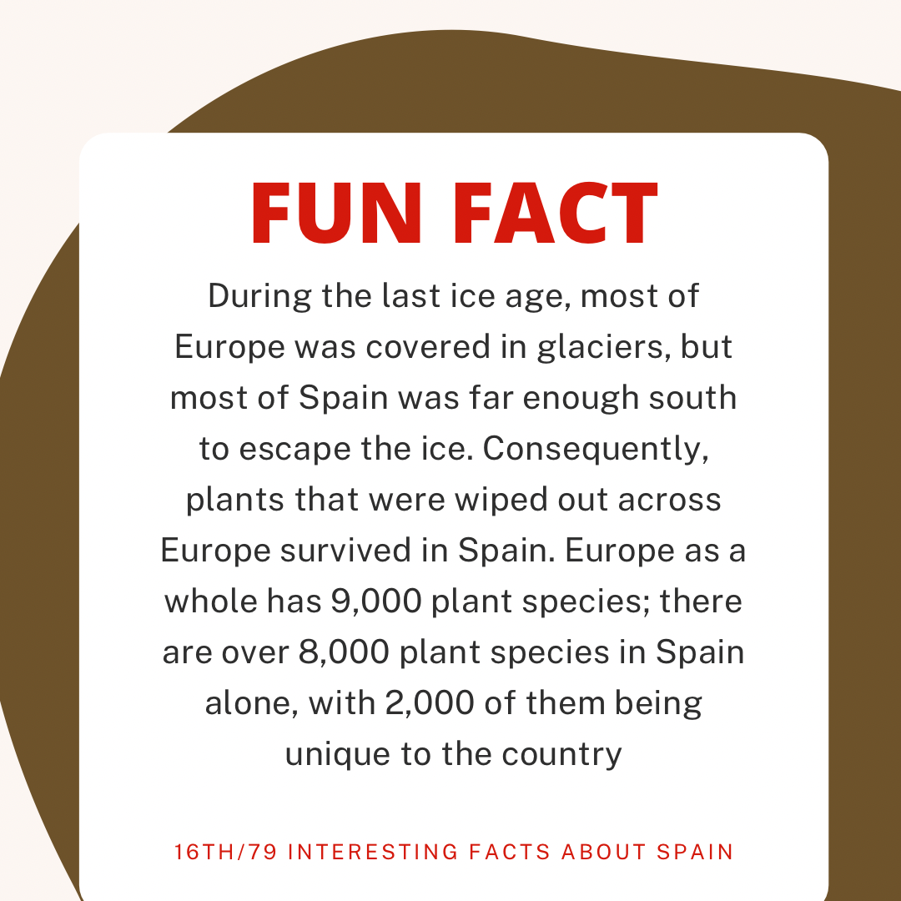

<h1> History</h1>

How does history affect language? Or perhaps it is the other way around? Would we even be able to understand history if we didn't have common language between a community of people? Language makes history accessible to a large number of people and creates a more intricate retelling of history which allows to organize data in a meaningful way, resulting in a complex interpretation of history. However, much like the example of society; do we shape society or does society shape us? The answer is that it works both ways, both affecting the other. The same way language can influence history, history also affect language. 

 As stated on the home page, learning a language isn't merely knowing grammar rules and expanding vocabulary, it also encompasses culture, history forms a large part of culture. Customs are created from historical events. The famous siestas that Spaniards are known for, for instance, was popularised because of how harsh the heat was. Field workers would take a few hours to shelter from the heat and refresh then return to work until late, working for longer than they would have without the break.

 This is a start to understanding Spanish speakers from Spain, watch the video below of a brief history of Spain and fill in the gaps of the activity below.

 

<iframe width="1000" height="480" src="https://www.youtube.com/embed/nPcfZLaMoAo" frameborder="0" allow="accelerometer; autoplay; clipboard-write; encrypted-media; gyroscope; picture-in-picture" allowfullscreen></iframe>
 
 

<iframe src="https://h5p.org/h5p/embed/1086230" width="999" height="1732" frameborder="0" allowfullscreen="allowfullscreen" allow="geolocation *; microphone *; camera *; midi *; encrypted-media *"></iframe>

 

 <small> Fact acquired from <a href="https://www.factretriever.com/spain-facts" target="_blank">Fact Retriever</a></small> 

 
