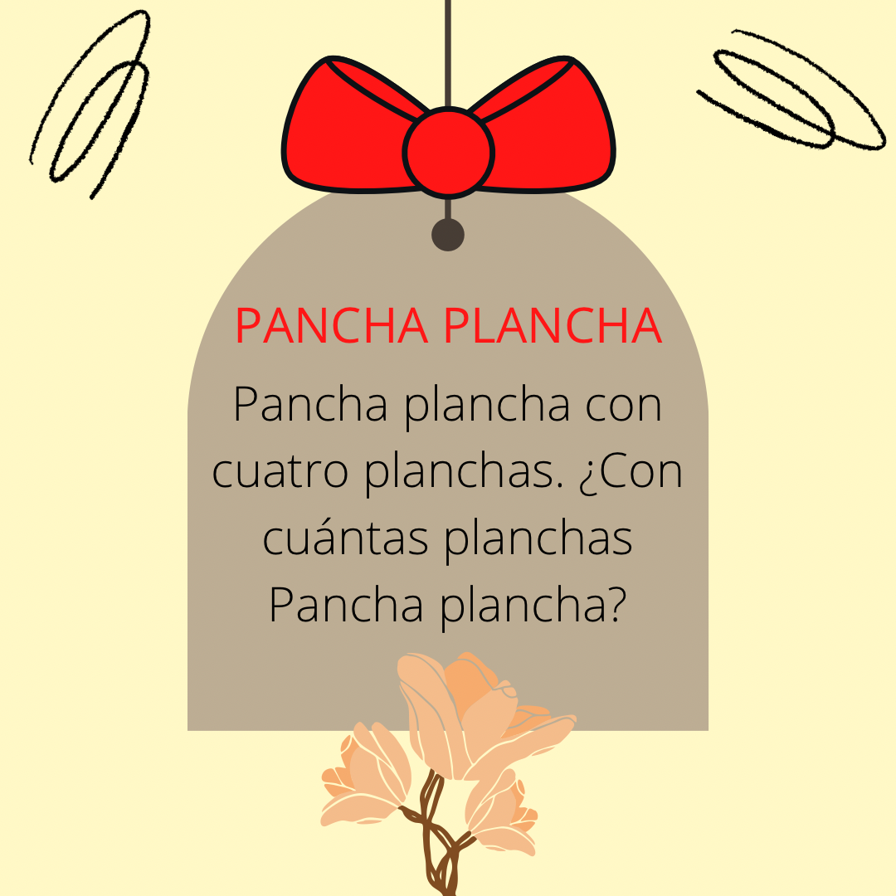
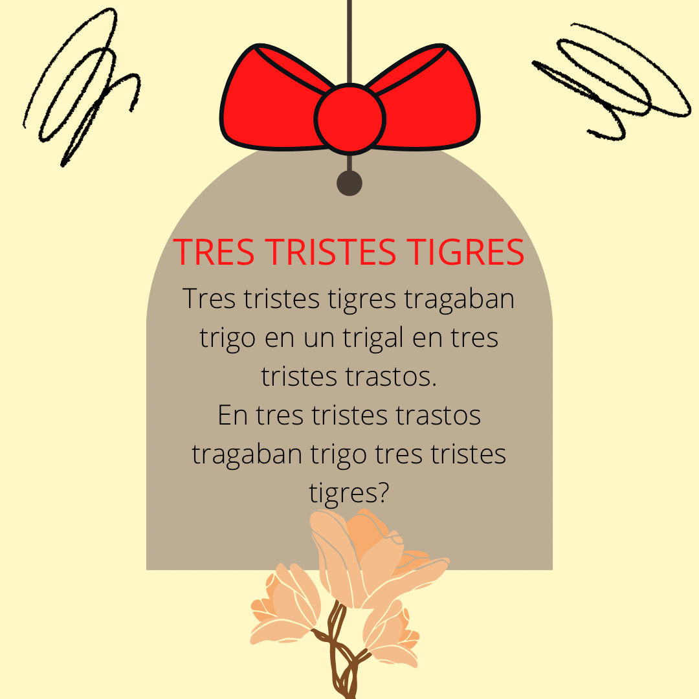
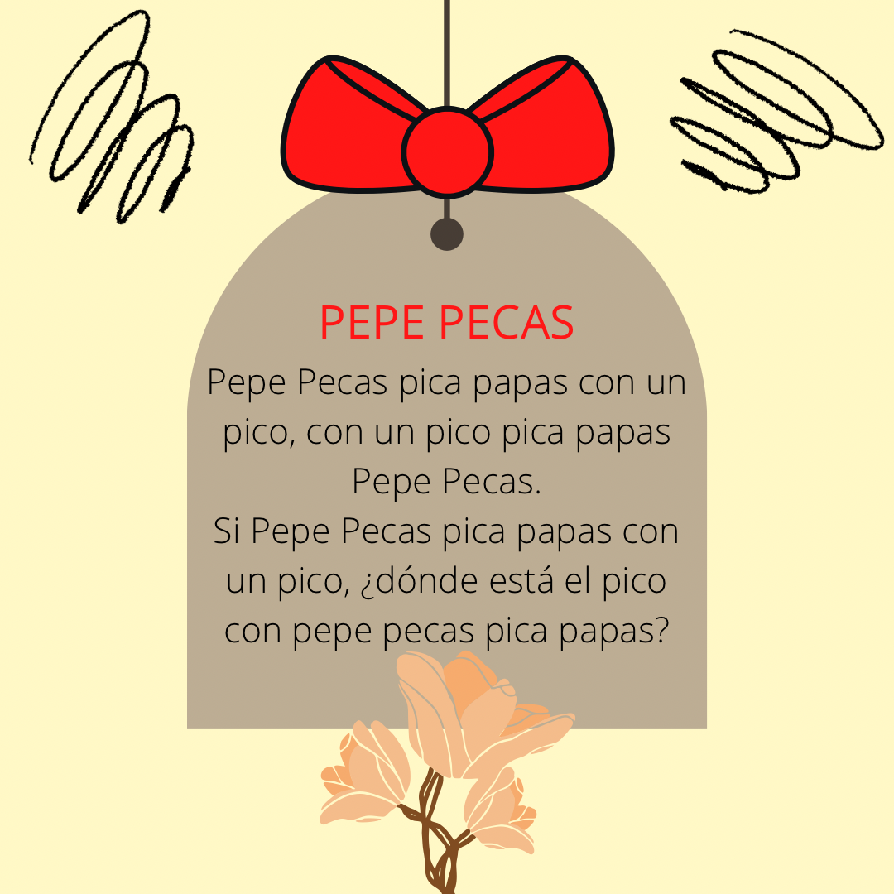
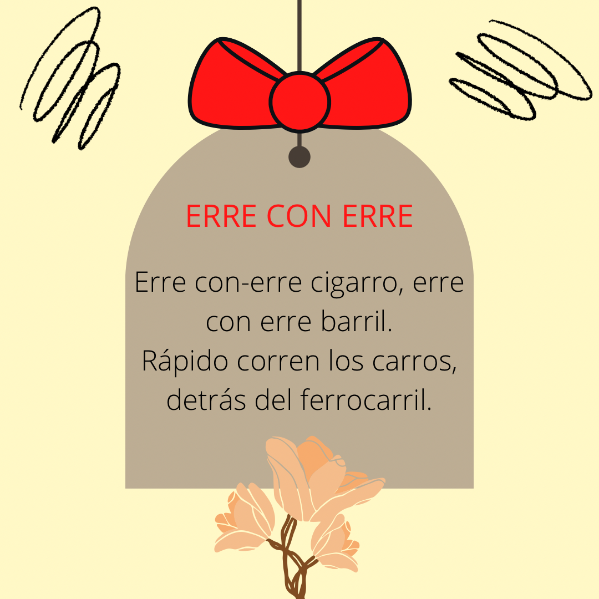

<h1> Tongue Twisters</h1>
  

 What better way to practise speaking and improve your pronounciation other than tongue twisters? Tongue twisters are a series of usually alliterative sounds or words that are difficult to pronounce correctly especially when spoken quickly. <i>For example: She sells seashells on the sea shore. </i> 

 Try the follow Spanish tongue twisters 

  
   
  

 

   
  

 

 

 <small>  All the images above were created by the Karol S. V. Lemes</small>

