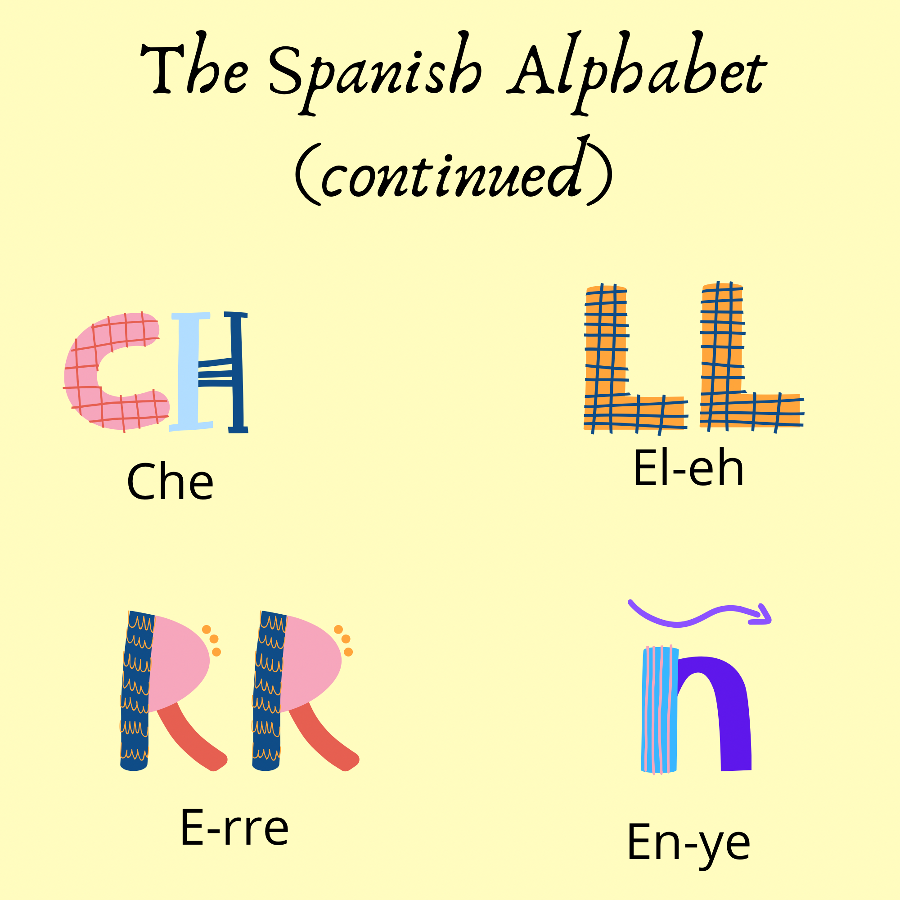

<h1> Tongue Twisters<h1>
  

 What better way to practise speaking and improve your pronounciation other than tongue twisters? Tongue twisters are a series of usually alliterative sounds or words that are difficult to pronounce correctly especially when spoken quickly. <i>For example: She sells seashells on the sea shore. </i>

  
  

  
